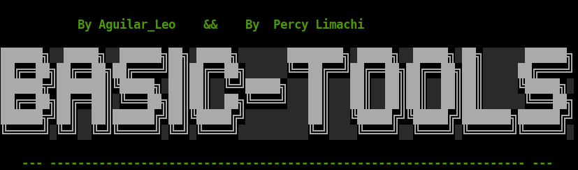

*Esta herramienta nos permite realizar multiples instalacions de manera **automatizada** de los paqutes y algunas otras aplicaiones externas que nos pueden servir al momento de instalar nuestro sistema operativo Linux*

<h1 align="center"> Basic-tools</h1>

 

### Etatus

- code coverage percentage: 
- stable release version: 
- package manager release: 
- status of third-party dependencies: 
- static code analysis grade: 
- [SemVer](https://semver.org/) version observance: 
- Bash package downloads: 
- Chrome Web Store extension rating: 
  
## Guía de usuario
---

<a href="basic-tools-guia.txt">Leer las instrucciones</a>

 	
## Guía de instalación
---
Paso a paso de cómo instalar la herramienta digital. En esta sección es recomendable explicar la arquitectura de carpetas, gestores y módulos que componen el sistema.

### Dependencias
Siga los pasos de instalacion correctamente para que no experimente errores en su instalacion.

## primero actualizamos los paquetes de nuestro sistema
    apt update && apt upgrade -y

## instalamos git
    apt install git

## clonamos este repositorio
    git clone https://github.com/H-Savvy/basic-tools.git

## Navega al directorio "basic-tools":
    cd basic-tools

## Otorga permisos de ejecución al script "basic-tools.sh":
    chmod +x basic-tools.sh

## Ejecuta el script "basic-tools.sh" con privilegios de superusuario:
    sudo ./basic-tools.sh
---

Recuerda leer las instrucciones del script para poder entender que realiza cada accion

---
